# [📈 Live Status](https://noveni.github.io/upptime): <!--live status--> **🟧 Partial outage**

This repository contains the open-source uptime monitor and status page for [Nicolas Novello](https://noveni.github.io/upptime), powered by [Upptime](https://github.com/upptime/upptime).

With [Upptime](https://upptime.js.org), you can get your own unlimited and free uptime monitor and status page, powered entirely by a GitHub repository. We use [Issues](https://github.com/noveni/upptime/issues) as incident reports, [Actions](https://github.com/noveni/upptime/actions) as uptime monitors, and [Pages](https://noveni.github.io/upptime) for the status page.

<!--start: status pages-->
<!-- This summary is generated by Upptime (https://github.com/upptime/upptime) -->
<!-- Do not edit this manually, your changes will be overwritten -->
<!-- prettier-ignore -->
| URL | Status | History | Response Time | Uptime |
| --- | ------ | ------- | ------------- | ------ |
|  [Ecrannoir](https://www.ecrannoir.be) | 🟩 Up | [ecrannoir.yml](https://github.com/noveni/upptime/commits/HEAD/history/ecrannoir.yml) | 

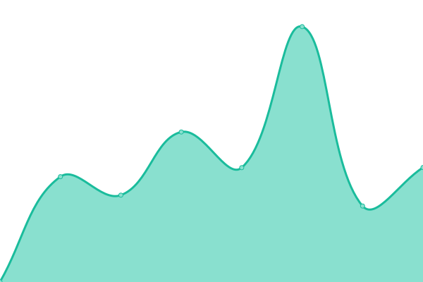 658ms
     
 | 

<a href="https://noveni.github.io/upptime/history/ecrannoir">100.00%</a>
    

|  [Broken Site](https://thissitedoesnotexist.com) | 🟥 Down | [broken-site.yml](https://github.com/noveni/upptime/commits/HEAD/history/broken-site.yml) | 

 0ms
     
 | 

<a href="https://noveni.github.io/upptime/history/broken-site">100.00%</a>
    

|  [Documentation](https://documentation.ecrannoir.be) | 🟩 Up | [documentation.yml](https://github.com/noveni/upptime/commits/HEAD/history/documentation.yml) | 

 916ms
     
 | 

<a href="https://noveni.github.io/upptime/history/documentation">100.00%</a>
    

|  [Jehanne Moll](https://jehannemoll.com) | 🟩 Up | [jehanne-moll.yml](https://github.com/noveni/upptime/commits/HEAD/history/jehanne-moll.yml) | 

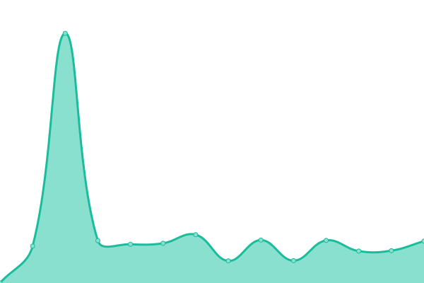 1352ms
     
 | 

<a href="https://noveni.github.io/upptime/history/jehanne-moll">100.00%</a>
    

|  [Beauté Engagée](https://www.beaute-engagee.be) | 🟩 Up | [beaute-engagee.yml](https://github.com/noveni/upptime/commits/HEAD/history/beaute-engagee.yml) | 

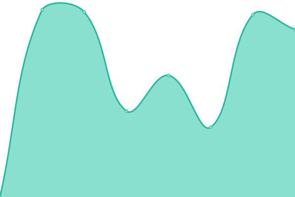 2788ms
     
 | 

<a href="https://noveni.github.io/upptime/history/beaute-engagee">99.62%</a>
    

|  [Paloma](https://www.paloma-latelier.be) | 🟥 Down | [paloma.yml](https://github.com/noveni/upptime/commits/HEAD/history/paloma.yml) | 

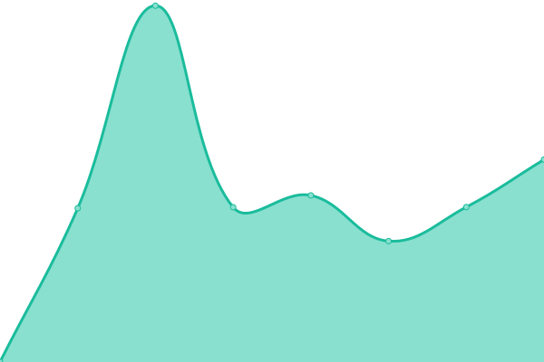 12167ms
     
 | 

<a href="https://noveni.github.io/upptime/history/paloma">91.69%</a>
    

|  [Nuance Infuse](https://www.nuanceinfuse.be) | 🟩 Up | [nuance-infuse.yml](https://github.com/noveni/upptime/commits/HEAD/history/nuance-infuse.yml) | 

 1731ms
     
 | 

<a href="https://noveni.github.io/upptime/history/nuance-infuse">99.77%</a>
    

|  [Coma ULG](https://www.coma.uliege.be) | 🟩 Up | [coma-ulg.yml](https://github.com/noveni/upptime/commits/HEAD/history/coma-ulg.yml) | 

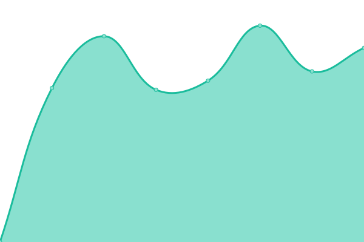 4289ms
     
 | 

<a href="https://noveni.github.io/upptime/history/coma-ulg">100.00%</a>
    

|  [Smart2Circle](https://smart2circle.com) | 🟩 Up | [smart2-circle.yml](https://github.com/noveni/upptime/commits/HEAD/history/smart2-circle.yml) | 

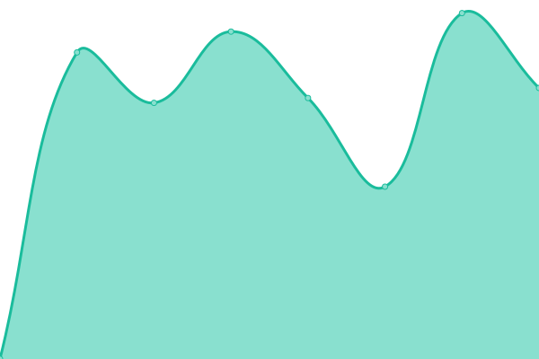 1564ms
     
 | 

<a href="https://noveni.github.io/upptime/history/smart2-circle">100.00%</a>
    

|  [Chanelle Delbrouck](http://beta.chanelledbck.com) | 🟩 Up | [chanelle-delbrouck.yml](https://github.com/noveni/upptime/commits/HEAD/history/chanelle-delbrouck.yml) | 

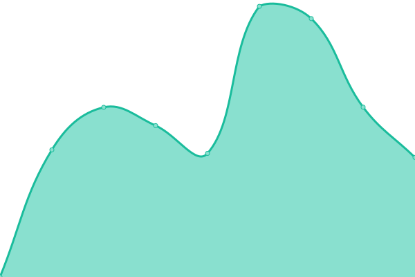 1999ms
     
 | 

<a href="https://noveni.github.io/upptime/history/chanelle-delbrouck">99.58%</a>
    

|  [Portal Herstal](https://portal.fnherstal.com) | 🟩 Up | [portal-herstal.yml](https://github.com/noveni/upptime/commits/HEAD/history/portal-herstal.yml) | 

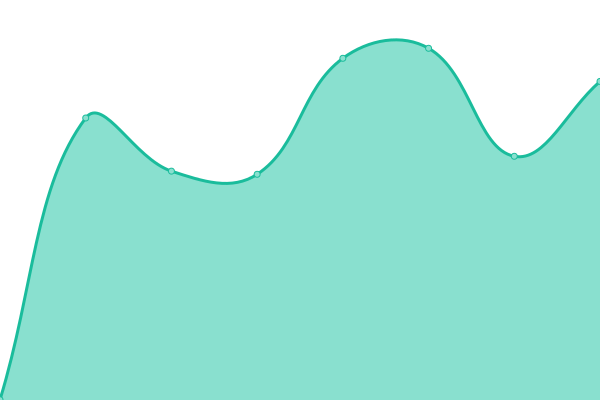 1071ms
     
 | 

<a href="https://noveni.github.io/upptime/history/portal-herstal">100.00%</a>
    

|  [Communication Herstal Group](https://communication.herstalgroup.com) | 🟩 Up | [communication-herstal-group.yml](https://github.com/noveni/upptime/commits/HEAD/history/communication-herstal-group.yml) | 

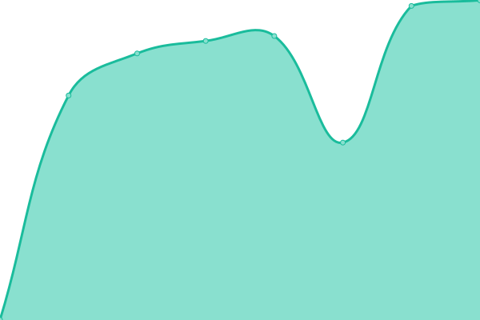 1914ms
     
 | 

<a href="https://noveni.github.io/upptime/history/communication-herstal-group">100.00%</a>
    

|  [FN Enovation](https://fnenovation.eu) | 🟩 Up | [fn-enovation.yml](https://github.com/noveni/upptime/commits/HEAD/history/fn-enovation.yml) | 

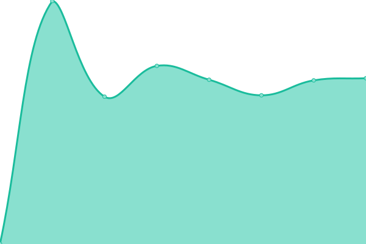 949ms
     
 | 

<a href="https://noveni.github.io/upptime/history/fn-enovation">100.00%</a>
    

|  [ESFAM](https://www.esfam.eu) | 🟩 Up | [esfam.yml](https://github.com/noveni/upptime/commits/HEAD/history/esfam.yml) | 

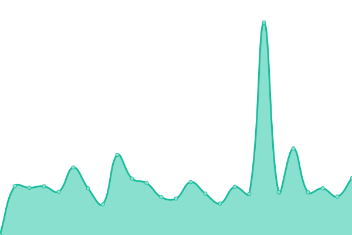 2215ms
     
 | 

<a href="https://noveni.github.io/upptime/history/esfam">100.00%</a>
    

<!--end: status pages-->

[**Visit our status website →**](https://noveni.github.io/upptime)

## 📄 License

- Powered by: [Upptime](https://github.com/upptime/upptime)
- Code: [MIT](./LICENSE) © [Nicolas Novello](https://noveni.github.io/upptime)
- Data in the `./history` directory: [Open Database License](https://opendatacommons.org/licenses/odbl/1-0/)
